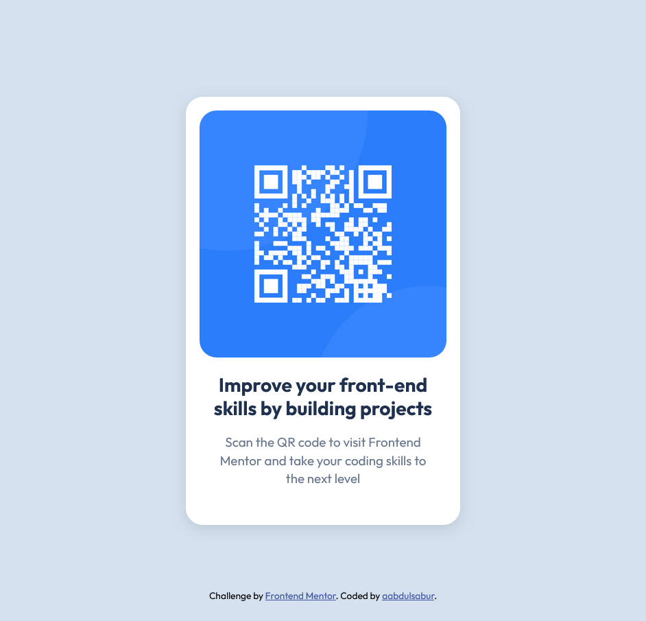

# Frontend Mentor - QR code component solution

This is a solution to the [QR code component challenge on Frontend Mentor](https://www.frontendmentor.io/challenges/qr-code-component-iux_sIO_H). Frontend Mentor challenges help you improve your coding skills by building realistic projects.

## Table of contents

- [Overview](#overview)
  - [Screenshot](#screenshot)
  - [Links](#links)
- [My process](#my-process)
  - [Built with](#built-with)
  - [What I learned](#what-i-learned)
- [Author](#author)

## Overview

### Screenshot

### Links

- Solution URL: [solution URL](https://frontend-mentor-qr-code-comp.netlify.app/)
- Live Site URL: [live site](https://frontend-mentor-qr-code-comp.netlify.app/)

## My process

### Built with

- Semantic HTML5 markup
- CSS custom properties

### What I learned

- centering a div using position absolute and transform properties
- working with img containers

## Author
- Frontend Mentor - [@aabdulsabur](https://www.frontendmentor.io/profile/aabdulsabur)
